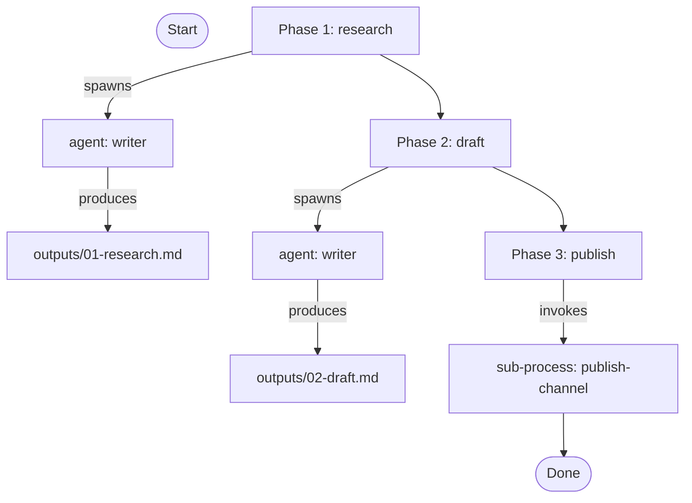

# pas-clief Implementation Plan

> **For agentic workers:** REQUIRED SUB-SKILL: Use `superpowers:subagent-driven-development` (recommended) or `superpowers:executing-plans` to implement this plan task-by-task. Steps use checkbox (`- [ ]`) syntax for tracking.

**Goal:** Build pas-clief as a new sibling plugin at `plugins/pas-clief/` — a script-free reimplementation of the PAS pattern using Van Clief's folder-as-workspace method, with a hybrid skill shape (main router + creation/management shortcuts).

**Architecture:** Pure markdown plugin. Seven user-facing skills (`pas-clief`, `init`, `add-agent`, `add-skill`, `add-process`, `upgrade`, `visualize`) plus library content (one example agent, three example skills, one example process). No bash, no hooks, no `status.yaml`. Slash commands discovered through Claude Code's standard skill system. Path resolution is search-order (local first, plugin fallback). Spec at `docs/plans/2026-04-29-pas-clief-design.md`.

**Tech Stack:** Markdown, YAML frontmatter (Agent Skills spec), JSON (plugin & marketplace manifests), `jq` for JSON validation.

---

## File Structure

### Created files

**Plugin manifest:**
- `plugins/pas-clief/.claude-plugin/plugin.json` — plugin manifest
- `plugins/pas-clief/README.md` — plugin documentation

**User-facing skills:**
- `plugins/pas-clief/skills/pas-clief/SKILL.md` — main router
- `plugins/pas-clief/skills/init/SKILL.md` — brainstorm + scaffold a fresh user workspace
- `plugins/pas-clief/skills/add-agent/SKILL.md` — create a local agent
- `plugins/pas-clief/skills/add-skill/SKILL.md` — create a local skill
- `plugins/pas-clief/skills/add-process/SKILL.md` — create a local process
- `plugins/pas-clief/skills/upgrade/SKILL.md` — sync conventions from a newer plugin
- `plugins/pas-clief/skills/visualize/SKILL.md` — render a process flow

**Library content (canonical examples):**
- `plugins/pas-clief/library/agents/writer/{CLAUDE.md,CONTEXT.md,changelog.md,feedback/.gitkeep}`
- `plugins/pas-clief/library/skills/web-research/{SKILL.md,changelog.md,feedback/.gitkeep}`
- `plugins/pas-clief/library/skills/drafting-style/{SKILL.md,changelog.md,feedback/.gitkeep}`
- `plugins/pas-clief/library/skills/polish-prose/{SKILL.md,changelog.md,feedback/.gitkeep}`

**Library process (lives in `skills/` per Section 12 of the spec, NOT `library/`):**
- `plugins/pas-clief/skills/newsletter/SKILL.md` — example process recipe
- `plugins/pas-clief/skills/newsletter/phases/01-research.md`
- `plugins/pas-clief/skills/newsletter/phases/02-draft.md`
- `plugins/pas-clief/skills/newsletter/phases/03-publish.md`
- `plugins/pas-clief/skills/newsletter/{changelog.md,feedback/.gitkeep}`

**Templates referenced by creation skills:**
- `plugins/pas-clief/templates/user-claude-md.md`
- `plugins/pas-clief/templates/user-references-md.md`
- `plugins/pas-clief/templates/workspace-claude-md.md`
- `plugins/pas-clief/templates/agent-claude-md.md`
- `plugins/pas-clief/templates/agent-context-md.md`
- `plugins/pas-clief/templates/skill-md.md`
- `plugins/pas-clief/templates/process-skill-md.md`
- `plugins/pas-clief/templates/process-phase-md.md`
- `plugins/pas-clief/templates/changelog-md.md`

### Modified files

- `.claude-plugin/marketplace.json` — add pas-clief plugin entry

---

## Convention notes for the implementer

- **No code, no scripts.** Everything in pas-clief is markdown or JSON.
- **YAML frontmatter** uses the Agent Skills spec: `name` and `description` are required; other fields (e.g., `agents`, `skills`, `phases`) are pas-clief conventions.
- **Skill descriptions** must be specific so Claude's skill router invokes them at the right time. Match the descriptive density of `plugins/pas/skills/pas/SKILL.md`.
- **Paths in skills** use literal strings (e.g., `library/agents/<name>/CLAUDE.md`); do NOT use `${CLAUDE_PLUGIN_ROOT}` or `${CLAUDE_SKILL_DIR}` because pas-clief is script-free. The orchestrator working in a user's project resolves paths relative to user-cwd via the search order.
- **Verify after each task.** Each task ends with one or more verification commands followed by a commit.
- **Commit per task.** Granularity is intentional — each commit produces a working state.

---

## Task 1: Plugin manifest and directory scaffold

**Files:**
- Create: `plugins/pas-clief/.claude-plugin/plugin.json`

- [ ] **Step 1: Create the plugin directory tree**

```bash
mkdir -p plugins/pas-clief/.claude-plugin
mkdir -p plugins/pas-clief/skills
mkdir -p plugins/pas-clief/library/agents
mkdir -p plugins/pas-clief/library/skills
mkdir -p plugins/pas-clief/templates
```

- [ ] **Step 2: Write `plugin.json`**

File: `plugins/pas-clief/.claude-plugin/plugin.json`

```json
{
  "name": "pas-clief",
  "description": "Script-free implementation of the PAS pattern (process / agent / skill) using Jake Van Clief's folder-as-workspace method. Personal workspace, no marketplace, no hooks, no enforcement — pure markdown discipline.",
  "version": "0.1.0",
  "author": {
    "name": "Zoran Spirkovski"
  },
  "homepage": "https://github.com/ZoranSpirkovski/PAS",
  "repository": "https://github.com/ZoranSpirkovski/PAS",
  "license": "MIT"
}
```

- [ ] **Step 3: Validate manifest is valid JSON**

Run: `jq . plugins/pas-clief/.claude-plugin/plugin.json`
Expected: prints the JSON formatted, no parse error.

- [ ] **Step 4: Commit**

```bash
git add plugins/pas-clief/.claude-plugin/plugin.json
git commit -m "feat(pas-clief): scaffold plugin directory and manifest"
```

---

## Task 2: Templates

**Files:**
- Create: `plugins/pas-clief/templates/{user-claude-md,user-references-md,workspace-claude-md,agent-claude-md,agent-context-md,skill-md,process-skill-md,process-phase-md,changelog-md}.md`

- [ ] **Step 1: Write `user-claude-md.md`**

File: `plugins/pas-clief/templates/user-claude-md.md`

```markdown
# {{workspace_name}}

{{one_to_three_line_identity}}

## Workspaces

- `library/agents/` — reusable agents you've defined for this workspace.
- `library/skills/` — reusable skills (capabilities) used by your agents and processes.
- `.claude/skills/<process>/` — your processes, slash-invokable as `/<process>`.
- `workspace/<process>/<session-id>/` — execution state for runs of your processes.

## Routing table

| Task | Go to | Read | Skills |
|------|-------|------|--------|
{{routing_rows}}

## Naming conventions

- Drafts: `_draft.md`. Final: `_final.md`. Versioned: `_v2.md`, `_v3.md`.
- Date prefix: `YYYY-MM-DD-<slug>.md`.
- Feedback: `feedback/YYYY-MM-DD-<source>-<topic>.md`.

## Rules

- **Workspace isolation.** Never reference one workspace's information inside another workspace's session.
- **Path resolution.** Plain names in process recipes search `library/` first (this project), then the plugin's library. Use `plugin:<name>` to force the plugin version.
- **Feedback.** Drop markdown into the relevant artifact's `feedback/` folder. Triage manually.
```

- [ ] **Step 2: Write `user-references-md.md`**

File: `plugins/pas-clief/templates/user-references-md.md`

```markdown
# References

Background material for this workspace — examples, links, brand voice notes, prior work. Loaded only when explicitly read.

{{user_content_or_blank}}
```

- [ ] **Step 3: Write `workspace-claude-md.md`**

File: `plugins/pas-clief/templates/workspace-claude-md.md`

```markdown
# Workspace inventory

Execution state for runs of this project's processes. Each session lives at `<process-name>/<session-id>/`.

## Layout per session

- `STATUS.md` — current phase, history of phase transitions, pointer to active outputs.
- `notes.md` — free-form session log (orchestrator and agents append here).
- `outputs/` — phase outputs. One file or folder per phase.
- `feedback/` — session-level feedback drops.

## Active sessions

(Populated by the orchestrator as sessions run; remove or archive when done.)
```

- [ ] **Step 4: Write `agent-claude-md.md`**

File: `plugins/pas-clief/templates/agent-claude-md.md`

```markdown
---
name: {{agent_name}}
description: {{one_line_role}}
skills:
{{skill_list_or_empty}}
---

# {{agent_name}}

## Role

{{role_paragraph}}

## Responsibilities

{{responsibilities_list}}

## Skills available

{{skills_explanation}}

## How to operate

When you are spawned as this agent:
1. Read your `CONTEXT.md` for the workspace details specific to this agent.
2. Read any phase-specific instructions handed to you by the orchestrator.
3. Use the skills listed above; read each skill's `SKILL.md` if you need its full procedure.
4. Write your output to the path the orchestrator names (typically `workspace/<process>/<session>/outputs/`).
5. Append a brief progress note to `workspace/<process>/<session>/notes.md` so the orchestrator can pick up where you left off.
```

- [ ] **Step 5: Write `agent-context-md.md`**

File: `plugins/pas-clief/templates/agent-context-md.md`

```markdown
# {{agent_name}} workspace

## What happens here

{{what_this_agent_does}}

## What files matter

{{files_or_artifacts}}

## What to avoid

{{anti_patterns}}
```

- [ ] **Step 6: Write `skill-md.md` (template for library skills)**

File: `plugins/pas-clief/templates/skill-md.md`

```markdown
---
name: {{skill_name}}
description: {{one_line_capability}}
---

# {{skill_name}}

## When to use

{{when_to_use_paragraph}}

## How to use

{{step_by_step}}

## Inputs

{{inputs_list}}

## Outputs

{{outputs_list}}

## Examples

{{example_invocation}}
```

- [ ] **Step 7: Write `process-skill-md.md`**

File: `plugins/pas-clief/templates/process-skill-md.md`

```markdown
---
name: {{process_name}}
description: {{one_line_what_this_does}}
agents:
{{agents_list}}
skills:
{{skills_list}}
sub_processes:
{{sub_processes_list_or_empty}}
phases:
{{phase_files_list}}
---

# {{process_name}}

## Goal

{{goal_paragraph}}

## How this process runs

When the orchestrator (you) is invoked via `/{{process_name}}`:

1. Create a session workspace at `workspace/{{process_name}}/<session-id>/` and initialize `STATUS.md`.
2. Walk the phases in order. For each phase:
   - Read the phase file in `phases/`.
   - Spawn the agent named in the phase (or invoke the sub-process) using the spawn pattern below.
   - Update `STATUS.md` with the phase transition.
   - `TaskCreate` a self-eval task for this phase. Clear it by writing the eval to `feedback/`.
3. When all phases are complete, mark `STATUS.md` complete and summarize for the user.

## Spawn pattern (agent)

```
Read your role at library/agents/<agent>/CLAUDE.md and your context at library/agents/<agent>/CONTEXT.md. Skills available: <list>. Task for this phase: <content from phases/NN-name.md>. Write output to workspace/{{process_name}}/<session>/outputs/<NN-name>.<ext>. Append progress to workspace/{{process_name}}/<session>/notes.md.
```

## Spawn pattern (sub-process)

```
You are running the process at <library or skills path>/<sub>/SKILL.md. Read the recipe and execute its phases as a sub-process; report back when done.
```

## Notes

{{authoring_notes}}
```

- [ ] **Step 8: Write `process-phase-md.md`**

File: `plugins/pas-clief/templates/process-phase-md.md`

```markdown
# Phase {{NN}}: {{phase_name}}

## Agent

{{agent_or_sub_process_name}}

## Inputs

{{inputs_list}}

## Outputs

{{outputs_list_with_paths}}

## Instructions

{{detailed_instructions}}

## Self-eval criteria

After the agent completes this phase, evaluate:

{{eval_criteria_list}}
```

- [ ] **Step 9: Write `changelog-md.md`**

File: `plugins/pas-clief/templates/changelog-md.md`

```markdown
# Changelog

## {{version_or_date}}

- {{change_summary}}
```

- [ ] **Step 10: Verify all templates exist**

Run: `ls plugins/pas-clief/templates/`
Expected: 9 files listed (`user-claude-md.md`, `user-references-md.md`, `workspace-claude-md.md`, `agent-claude-md.md`, `agent-context-md.md`, `skill-md.md`, `process-skill-md.md`, `process-phase-md.md`, `changelog-md.md`).

- [ ] **Step 11: Commit**

```bash
git add plugins/pas-clief/templates/
git commit -m "feat(pas-clief): templates for user workspace, agents, skills, processes"
```

---

## Task 3: Main `/pas-clief` skill (router)

**Files:**
- Create: `plugins/pas-clief/skills/pas-clief/SKILL.md`

- [ ] **Step 1: Write `pas-clief/SKILL.md`**

File: `plugins/pas-clief/skills/pas-clief/SKILL.md`

```markdown
---
name: pas-clief
description: Use when creating, managing, or running processes, agents, and skills using the script-free folder-as-workspace method. Single entry point for pas-clief — routes to the right shortcut based on user intent.
---

# pas-clief

This is the main entry point for pas-clief. Pas-clief is a script-free implementation of the PAS pattern (process / agent / skill) using Jake Van Clief's folder-as-workspace method. There are no hooks, no scripts, no enforcement — pure markdown discipline.

## How to route

Read the user's intent and route to the appropriate shortcut skill:

- **"set up a workspace" / "I'm starting a project" / "init" / "scaffold"** → invoke `pas-clief:init`. Do not improvise scaffolding.
- **"add an agent" / "create a writer agent"** → invoke `pas-clief:add-agent`.
- **"add a skill" / "create a capability"** → invoke `pas-clief:add-skill`.
- **"add a process" / "new pipeline" / "new workflow"** → invoke `pas-clief:add-process`.
- **"upgrade" / "what's new in pas-clief"** → invoke `pas-clief:upgrade`.
- **"show me this process" / "visualize"** → invoke `pas-clief:visualize`.
- **"run X" / "execute X"** where X is a process → if `<user-project>/.claude/skills/<x>/` or `plugins/pas-clief/skills/<x>/` exists, invoke that slash command directly. The user can also run it themselves: `/<x>`.

If the user's intent is ambiguous, ask one clarifying question. Do not assume.

## Workspace gate

Pas-clief works inside a workspace folder — typically the project root where the user keeps their `library/` and `.claude/skills/` content. Before running a creation or management skill, verify a `CLAUDE.md` exists at the cwd root of this workspace. If not, suggest `pas-clief:init` first.

## What pas-clief is

- Personal workspace, no marketplace concept.
- Library + local pattern: canonical reusable items live in this plugin (`plugins/pas-clief/library/`); users create their own in `<user-project>/library/`. Local shadows plugin via search order.
- Processes are slash-invokable: plugin processes as `/pas-clief:<name>`, user processes as `/<name>`.
- Lifecycle, feedback, and self-eval are pure conventions: phases as ordered files, status in workspace session folders, feedback as plain markdown drops, self-eval as Claude Code tasks.

## Conversation style

- Brainstorming mode: clarify intent before scaffolding.
- One question at a time.
- No PAS jargon unless the user uses it first. Speak in goals and tasks.
```

- [ ] **Step 2: Verify frontmatter is valid YAML**

Run: `awk '/^---$/{flag=!flag;next} flag' plugins/pas-clief/skills/pas-clief/SKILL.md | head -5`
Expected: prints `name: pas-clief` and `description: Use when ...` lines.

- [ ] **Step 3: Commit**

```bash
git add plugins/pas-clief/skills/pas-clief/SKILL.md
git commit -m "feat(pas-clief): main skill — intelligent router"
```

---

## Task 4: `/pas-clief:init` skill

**Files:**
- Create: `plugins/pas-clief/skills/init/SKILL.md`

- [ ] **Step 1: Write `init/SKILL.md`**

File: `plugins/pas-clief/skills/init/SKILL.md`

```markdown
---
name: init
description: Use when scaffolding a new pas-clief workspace. Brainstorms with the user about what they're building (or what they want to figure out), then writes a tailored `CLAUDE.md` and minimum-viable structure. The deliverable is shared understanding — by the end of the conversation, the LLM understands what the user wants and the workspace reflects it.
---

# pas-clief:init

Goal: a brand-new workspace where the next session opened in this folder responds with awareness of what's going on. Starting matters more than starting perfectly, but the first impression matters.

## Flow

### 1. Confirm the workspace folder

Verify the cwd is the intended workspace root (where `CLAUDE.md`, `library/`, `workspace/`, and `.claude/skills/` will live). Ask the user to confirm. If a `CLAUDE.md` already exists, refuse to overwrite — offer `pas-clief:upgrade` instead.

### 2. Ask the framing question

> "What are you trying to build with pas-clief?
> (a) I have a use case in mind — let me describe it.
> (b) I'm not sure yet — let's figure it out together."

### 3a. Branch (a) — clear use case

Walk through:
1. Workspace name (free text).
2. The first kind of work this workspace does. Phrase it as a task: e.g., "draft a weekly newsletter," "respond to support tickets," "review pull requests."
3. The agents involved. Start with one if possible. Pick from the plugin library (`library/agents/writer` is included as a starter) or sketch a new local agent.
4. The skills the agent uses. Pick from plugin library (`library/skills/web-research`, `library/skills/drafting-style`, `library/skills/polish-prose`) or note new ones to create.
5. The phases of the process. Three to five typical.
6. Naming conventions the user already uses for files.

As the conversation produces clarity, draft the `CLAUDE.md` content in your head. Show the user the routing table once before writing it.

### 3b. Branch (b) — unclear

Open-ended brainstorm. Ask, in order:
1. What kinds of work recur in your life or job?
2. Which of those would benefit from a repeatable process?
3. Who or what currently does each piece — you, a tool, a person, a habit?
4. What does "done well" look like for that work?
5. Is there one of these we can start with today?

When a candidate process emerges, switch to branch (a) for that one. The user can stop with whatever they have.

### 4. Scaffold

Read the template at `plugins/pas-clief/templates/user-claude-md.md`. Substitute placeholders with the conversation's results:

- `{{workspace_name}}` — the workspace name.
- `{{one_to_three_line_identity}}` — what this workspace is.
- `{{routing_rows}}` — one row per task identified, columns `Task | Go to | Read | Skills`.

Write to `<cwd>/CLAUDE.md`.

Create directories:

```
mkdir -p library/agents library/skills .claude/skills workspace
```

Write `workspace/CLAUDE.md` from `plugins/pas-clief/templates/workspace-claude-md.md` (no substitutions needed for this file).

If the user has reference material (links, examples), write `REFERENCES.md` from `plugins/pas-clief/templates/user-references-md.md`. Otherwise skip.

If the user named a first process during the conversation, immediately invoke `pas-clief:add-process` to create it. Pass the agreed-upon name and structure.

### 5. Close

Tell the user:

> "You have what you need to begin. Open this folder in a fresh `claude` session to feel the difference — your routing table is now part of every prompt. When a new kind of work shows up, run `/pas-clief:add-process`. Improvements are normal — the workspace evolves with you."

## Anti-patterns

- Do not scaffold without conversation. Generic placeholder content defeats the purpose.
- Do not refuse to start. The user's "I don't know" branch is a real branch.
- Do not write hooks, status files, or any script. Pas-clief is convention all the way down.
```

- [ ] **Step 2: Verify the file references the templates correctly**

Run: `grep -c 'templates/user-claude-md.md\|templates/user-references-md.md\|templates/workspace-claude-md.md' plugins/pas-clief/skills/init/SKILL.md`
Expected: at least 3 (one per template referenced).

- [ ] **Step 3: Commit**

```bash
git add plugins/pas-clief/skills/init/SKILL.md
git commit -m "feat(pas-clief): init skill — brainstorm and scaffold a workspace"
```

---

## Task 5: `/pas-clief:add-agent` skill

**Files:**
- Create: `plugins/pas-clief/skills/add-agent/SKILL.md`

- [ ] **Step 1: Write `add-agent/SKILL.md`**

File: `plugins/pas-clief/skills/add-agent/SKILL.md`

```markdown
---
name: add-agent
description: Use when creating a local agent for a pas-clief workspace. Walks the user through naming the agent, defining its role, listing its skills, and writing CLAUDE.md and CONTEXT.md from templates. The agent lands in `library/agents/<name>/`.
---

# pas-clief:add-agent

Goal: a new local agent in `<user-project>/library/agents/<name>/` that mirrors the shape of plugin library agents.

## Flow

### 1. Name and role

Ask:
- "What is the agent's name? (Short, lowercase, hyphenated. Example: `writer`, `code-reviewer`, `support-responder`.)"
- "In one line, what is this agent's role?"
- "What kind of work does it do? Describe it in 2–3 sentences."

If the user picks a name that already exists at `library/agents/<name>/` (local) or in the plugin library, ask:
- "An agent named `<name>` already exists. Replace, extend (shadow), or rename?"

### 2. Responsibilities

Ask:
- "What is this agent responsible for? List 2–5 bullets."

### 3. Skills

Ask:
- "Which skills does this agent use? You can pick from `library/skills/` (this project) or `plugins/pas-clief/library/skills/` (the plugin). You can also list new skills to create afterwards."

If a named skill doesn't exist anywhere, note it and offer to invoke `pas-clief:add-skill` after this.

### 4. Workspace context

Ask:
- "What files does this agent typically work with?"
- "What should it avoid? Anti-patterns, common mistakes, naming traps."

### 5. Write the files

Create directory: `library/agents/<name>/`
Read template `plugins/pas-clief/templates/agent-claude-md.md` and substitute placeholders. Write to `library/agents/<name>/CLAUDE.md`.
Read template `plugins/pas-clief/templates/agent-context-md.md` and substitute placeholders. Write to `library/agents/<name>/CONTEXT.md`.
Read template `plugins/pas-clief/templates/changelog-md.md` and write to `library/agents/<name>/changelog.md` with an initial entry: `## 2026-04-29\n\n- Created agent.`
Create directory: `library/agents/<name>/feedback/` (empty).

### 6. Close

Tell the user:

> "Agent `<name>` is ready at `library/agents/<name>/`. Reference it in process recipes by name (search-order resolves to your local version automatically). Use `pas-clief:add-skill` if any of its skills don't exist yet."

If the user named skills that don't exist, follow up: "Want me to scaffold those skills now?"

## Anti-patterns

- Don't write the agent without a real conversation about what it does. Templates with placeholder text defeat the purpose.
- Don't use vague descriptions. The agent's role description is what the orchestrator reads when it spawns this agent — specificity matters.
```

- [ ] **Step 2: Verify the file exists and frontmatter is valid**

Run: `awk '/^---$/{flag=!flag;next} flag' plugins/pas-clief/skills/add-agent/SKILL.md | head -2`
Expected: prints `name: add-agent` and `description: Use when ...`.

- [ ] **Step 3: Commit**

```bash
git add plugins/pas-clief/skills/add-agent/SKILL.md
git commit -m "feat(pas-clief): add-agent skill — scaffold a local agent"
```

---

## Task 6: `/pas-clief:add-skill` skill

**Files:**
- Create: `plugins/pas-clief/skills/add-skill/SKILL.md`

- [ ] **Step 1: Write `add-skill/SKILL.md`**

File: `plugins/pas-clief/skills/add-skill/SKILL.md`

```markdown
---
name: add-skill
description: Use when creating a local skill for a pas-clief workspace — a callable capability that agents and processes invoke by name. Walks the user through naming, when-to-use, how-to-use, inputs, and outputs. The skill lands in `library/skills/<name>/`.
---

# pas-clief:add-skill

Goal: a new local skill in `<user-project>/library/skills/<name>/` that agents and processes can reference by name.

## Flow

### 1. Name and capability

Ask:
- "What is the skill's name? (Short, lowercase, hyphenated. Example: `web-research`, `polish-prose`, `summarize-thread`.)"
- "In one line, what capability does this skill provide?"

If the name collides with an existing skill, ask: replace / extend / rename?

### 2. Substance

Ask:
- "When should this skill be used? Describe the trigger condition."
- "How is it used? Walk me through the procedure step-by-step."
- "What inputs does it need?"
- "What outputs does it produce?"
- "Do you have an example invocation we can write down?"

### 3. Write the files

Create directory: `library/skills/<name>/`
Read template `plugins/pas-clief/templates/skill-md.md` and substitute placeholders. Write to `library/skills/<name>/SKILL.md`.
Read template `plugins/pas-clief/templates/changelog-md.md` and write to `library/skills/<name>/changelog.md` with an initial entry.
Create directory: `library/skills/<name>/feedback/` (empty).

### 4. Close

Tell the user:

> "Skill `<name>` is ready at `library/skills/<name>/`. Reference it from agents (in their `skills:` frontmatter) or processes (in their `skills:` frontmatter) by name. Search-order resolves to your local version automatically."

## Anti-patterns

- Don't write the skill without specific when-to-use criteria. Vague triggers cause Claude's skill router to misfire.
- Don't make a skill where a step in a phase file would do. Skills are reusable across many tasks; if it's only used in one process, it's a phase, not a skill.
```

- [ ] **Step 2: Commit**

```bash
git add plugins/pas-clief/skills/add-skill/SKILL.md
git commit -m "feat(pas-clief): add-skill skill — scaffold a local skill"
```

---

## Task 7: `/pas-clief:add-process` skill

**Files:**
- Create: `plugins/pas-clief/skills/add-process/SKILL.md`

- [ ] **Step 1: Write `add-process/SKILL.md`**

File: `plugins/pas-clief/skills/add-process/SKILL.md`

```markdown
---
name: add-process
description: Use when creating a local process for a pas-clief workspace — a recipe that composes agents, skills, and phases into a slash-invokable workflow. The process lands in `.claude/skills/<name>/` so it becomes invocable as `/<name>`.
---

# pas-clief:add-process

Goal: a new local process at `<user-project>/.claude/skills/<name>/` that the user can run as `/<name>`.

## Flow

### 1. Name and goal

Ask:
- "What is the process's name? (Short, lowercase, hyphenated. Example: `newsletter`, `triage-tickets`, `weekly-review`.)"
- "In one line, what does this process do? (This becomes the slash command's description; specificity matters.)"
- "Describe the goal in a paragraph: what does the user get when this process is done?"

### 2. Composition

Ask:
- "Which agents does this process use? You can pick from `library/agents/` (this project) or `plugins/pas-clief/library/agents/` (the plugin). For new agents we'll invoke `pas-clief:add-agent` after this."
- "Which skills are needed beyond what each agent already declares?"
- "Are there sub-processes — other processes this one calls? (Optional.)"

### 3. Phases

Ask:
- "Walk me through the phases. Three to five is typical. For each phase: name, which agent (or sub-process), what the phase produces."

### 4. Write the files

Create directory: `.claude/skills/<name>/phases/`
Create directory: `.claude/skills/<name>/feedback/` (empty)

Read template `plugins/pas-clief/templates/process-skill-md.md`. Substitute:
- `{{process_name}}`, `{{one_line_what_this_does}}`, `{{goal_paragraph}}`
- `{{agents_list}}` — YAML list, one `- <name>` per agent
- `{{skills_list}}` — YAML list, one `- <name>` per skill
- `{{sub_processes_list_or_empty}}` — YAML list, or `[]`
- `{{phase_files_list}}` — YAML list of phase filenames in order
- `{{authoring_notes}}` — any extra notes

Write to `.claude/skills/<name>/SKILL.md`.

For each phase, read template `plugins/pas-clief/templates/process-phase-md.md`. Substitute:
- `{{NN}}` — two-digit phase number (`01`, `02`, ...)
- `{{phase_name}}`, `{{agent_or_sub_process_name}}`, `{{inputs_list}}`, `{{outputs_list_with_paths}}`, `{{detailed_instructions}}`, `{{eval_criteria_list}}`

Write each phase to `.claude/skills/<name>/phases/NN-<slug>.md`.

Read template `plugins/pas-clief/templates/changelog-md.md` and write to `.claude/skills/<name>/changelog.md` with an initial entry.

### 5. Update the routing table

Open `<cwd>/CLAUDE.md`, find the routing table, append a row:

```
| <task description> | /<name> |  |  |
```

### 6. Close

Tell the user:

> "Process `<name>` is ready at `.claude/skills/<name>/`. You can invoke it as `/<name>` from anywhere in this workspace. The routing table now lists it. Run a test session when you're ready — the orchestrator will create `workspace/<name>/<session-id>/` automatically."

If any agents or skills the user named don't exist yet, follow up with the relevant scaffolding skill.

## Anti-patterns

- Don't draft phases without knowing what each phase produces. "Phase 2: thinking" is not a phase; "Phase 2: outline draft → outline.md" is.
- Don't reference agents that don't exist. Either scaffold them first or note them as a follow-up.
- Don't put a process in `library/processes/` — pas-clief processes live in `.claude/skills/` (user) or `plugins/pas-clief/skills/` (plugin) so they're slash-invokable. The library is for components only.
```

- [ ] **Step 2: Commit**

```bash
git add plugins/pas-clief/skills/add-process/SKILL.md
git commit -m "feat(pas-clief): add-process skill — scaffold a local process recipe"
```

---

## Task 8: `/pas-clief:upgrade` skill

**Files:**
- Create: `plugins/pas-clief/skills/upgrade/SKILL.md`

- [ ] **Step 1: Write `upgrade/SKILL.md`**

File: `plugins/pas-clief/skills/upgrade/SKILL.md`

```markdown
---
name: upgrade
description: Use when checking that a pas-clief workspace is current with the latest plugin conventions, or when migrating from an older version. Walks a checklist of structural and template changes and offers to apply each.
---

# pas-clief:upgrade

Goal: bring an existing workspace into alignment with the current pas-clief plugin without overwriting user content.

## Checklist

For each item, check the user's workspace and apply only if the user agrees.

1. **Plugin version.** Read `plugins/pas-clief/.claude-plugin/plugin.json`. Compare to a `pas-clief-version:` line in the user's `CLAUDE.md` (if present). Report any version skew.
2. **Root `CLAUDE.md` shape.** Verify it has all required sections: identity, workspaces, routing table, naming conventions, rules. List any missing.
3. **Library directories.** Verify `library/agents/` and `library/skills/` exist. Create if missing.
4. **Workspace folder.** Verify `workspace/CLAUDE.md` exists with the current inventory format. Offer to refresh from the template if not.
5. **Process recipes.** For each `.claude/skills/<name>/SKILL.md`, verify frontmatter contains the keys `name`, `description`, `agents`, `skills`, `phases`. Report missing keys.
6. **Naming conventions.** Verify the user's CLAUDE.md naming conventions section is present. If missing, suggest the default block.

For any change the user accepts, apply minimally. Do not overwrite content the user has tailored — merge sections, append rows, fix only the structural issue.

## Close

Summarize: what was checked, what was changed, what was deferred. Offer to file open items in a `feedback/` folder so they aren't lost.
```

- [ ] **Step 2: Commit**

```bash
git add plugins/pas-clief/skills/upgrade/SKILL.md
git commit -m "feat(pas-clief): upgrade skill — checklist for workspace migration"
```

---

## Task 9: `/pas-clief:visualize` skill

**Files:**
- Create: `plugins/pas-clief/skills/visualize/SKILL.md`

- [ ] **Step 1: Write `visualize/SKILL.md`**

File: `plugins/pas-clief/skills/visualize/SKILL.md`

```markdown
---
name: visualize
description: Use when rendering a process flow as a markdown diagram — phases, agents, sub-processes, and the data passed between them. Reads the process recipe and outputs a Mermaid-compatible flowchart.
---

# pas-clief:visualize

Goal: a Mermaid flowchart for a process, useful for understanding flow at a glance and for sharing with others.

## Flow

### 1. Pick the process

Ask: "Which process do you want to visualize?"

If the user gives a name, resolve it via search order: `<user-project>/.claude/skills/<name>/SKILL.md` first, then `<plugin>/skills/<name>/SKILL.md`. Read the recipe.

### 2. Read the recipe

Parse the YAML frontmatter. Extract:
- `agents`, `skills`, `sub_processes`, `phases`.

For each phase, read `phases/NN-<slug>.md` and extract the agent or sub-process named.

### 3. Render

Output a Mermaid flowchart:



Adjust nodes and edges to match the actual recipe. Include:
- Each phase as a node (with phase number).
- Each agent the phase spawns as a sub-node.
- Each sub-process invocation as a sub-node.
- Outputs file as a leaf if specified.

### 4. Write or display

Ask: "Save this to a file (`docs/flow-<process>.md`) or just display?"

If save: write the Mermaid block in a markdown file at the path the user names.
If display: emit the Mermaid block in the chat reply.

## Notes

- Do NOT introduce new state — visualize is read-only.
- If a phase file references an agent or sub-process that doesn't exist, surface the gap as a note in the rendered output.
```

- [ ] **Step 2: Commit**

```bash
git add plugins/pas-clief/skills/visualize/SKILL.md
git commit -m "feat(pas-clief): visualize skill — render a process flow as Mermaid"
```

---

## Task 10: Library agent — `writer`

**Files:**
- Create: `plugins/pas-clief/library/agents/writer/{CLAUDE.md,CONTEXT.md,changelog.md,feedback/.gitkeep}`

- [ ] **Step 1: Create directory and `.gitkeep`**

```bash
mkdir -p plugins/pas-clief/library/agents/writer/feedback
touch plugins/pas-clief/library/agents/writer/feedback/.gitkeep
```

- [ ] **Step 2: Write `writer/CLAUDE.md`**

File: `plugins/pas-clief/library/agents/writer/CLAUDE.md`

```markdown
---
name: writer
description: Drafts prose — newsletters, articles, thread responses, summaries. Operates from a brief and existing source material.
skills:
  - web-research
  - drafting-style
  - polish-prose
---

# writer

## Role

You draft prose. You take a brief, gather what you need, produce a draft, and polish it. You write to be read — clear, direct, free of filler.

## Responsibilities

- Receive a topic or brief from the orchestrator.
- Gather supporting material via the `web-research` skill if not provided.
- Produce a draft that meets the form requested (newsletter, article, response).
- Polish prose using `polish-prose`. Hand off the polished output as a markdown file at the path the orchestrator names.

## Skills available

- `web-research` — gather sources for a topic.
- `drafting-style` — apply the workspace's style conventions to a draft.
- `polish-prose` — line-edit a draft for clarity and economy.

## How to operate

1. Read your `CONTEXT.md` for what this workspace expects of you specifically.
2. Read the orchestrator's per-phase instructions.
3. Load any skills you need (read their `SKILL.md`).
4. Write your draft to `workspace/<process>/<session>/outputs/<NN-name>.md`.
5. Append a one-line progress note to `workspace/<process>/<session>/notes.md`.
```

- [ ] **Step 3: Write `writer/CONTEXT.md`**

File: `plugins/pas-clief/library/agents/writer/CONTEXT.md`

```markdown
# writer workspace

## What happens here

The writer agent drafts prose for the workspace's processes. It is invoked by the orchestrator at phases where written output is the deliverable (drafts, responses, summaries, copy).

## What files matter

- `workspace/<process>/<session>/inputs/` — briefs, notes, source material the orchestrator hands in.
- `workspace/<process>/<session>/outputs/` — your output goes here.
- The skill `SKILL.md` files for the skills you're invoking.

## What to avoid

- Padding. If a sentence isn't earning its keep, cut it.
- Editorializing where a fact will do.
- Writing past the brief. Stop at the requested length.
- Skipping `polish-prose` on the final pass — the workspace expects polished output.
```

- [ ] **Step 4: Write `writer/changelog.md`**

File: `plugins/pas-clief/library/agents/writer/changelog.md`

```markdown
# Changelog

## 2026-04-29

- Created writer agent. Initial skills: web-research, drafting-style, polish-prose.
```

- [ ] **Step 5: Commit**

```bash
git add plugins/pas-clief/library/agents/writer/
git commit -m "feat(pas-clief): library agent — writer"
```

---

## Task 11: Library skills — `web-research`, `drafting-style`, `polish-prose`

**Files:**
- Create: `plugins/pas-clief/library/skills/web-research/{SKILL.md,changelog.md,feedback/.gitkeep}`
- Create: `plugins/pas-clief/library/skills/drafting-style/{SKILL.md,changelog.md,feedback/.gitkeep}`
- Create: `plugins/pas-clief/library/skills/polish-prose/{SKILL.md,changelog.md,feedback/.gitkeep}`

- [ ] **Step 1: Create directories**

```bash
for skill in web-research drafting-style polish-prose; do
  mkdir -p plugins/pas-clief/library/skills/$skill/feedback
  touch plugins/pas-clief/library/skills/$skill/feedback/.gitkeep
done
```

- [ ] **Step 2: Write `web-research/SKILL.md`**

File: `plugins/pas-clief/library/skills/web-research/SKILL.md`

```markdown
---
name: web-research
description: Use when an agent needs to gather sources or background information from the web for a topic. Produces a concise sources file with URLs, summaries, and the most relevant excerpts.
---

# web-research

## When to use

You need outside information to draft, fact-check, or contextualize a piece of work. The orchestrator named this skill in your spawn prompt.

## How to use

1. Identify the topic. The orchestrator hands you a brief or question.
2. Use available web tools (WebFetch, WebSearch) to gather 3–7 sources.
3. For each source: capture the URL, a 2–3 sentence summary, and the single most relevant excerpt.
4. Write the result to `workspace/<process>/<session>/outputs/<NN>-sources.md` in this format:

```markdown
# Sources for {{topic}}

## {{title or domain}}

- url: {{url}}
- summary: {{2-3 sentences}}
- excerpt: > {{quote}}
```

5. Note any contradictions between sources — flag them so the next phase can address them.

## Inputs

- A topic or question (string).
- Any prior session material that hints at known sources.

## Outputs

- A markdown file with N source entries.
- A short summary line in `notes.md`: `web-research: gathered N sources for <topic>`.
```

- [ ] **Step 3: Write `drafting-style/SKILL.md`**

File: `plugins/pas-clief/library/skills/drafting-style/SKILL.md`

```markdown
---
name: drafting-style
description: Use when applying a workspace's drafting conventions to written output — voice, format, sentence rhythm, the things that make output feel like it belongs to this project. Reads the workspace's style notes if any and adjusts the draft accordingly.
---

# drafting-style

## When to use

You have a first draft and need to align it to this workspace's conventions before polishing for line clarity. The orchestrator named this skill in your spawn prompt.

## How to use

1. Read `<workspace-root>/REFERENCES.md` if it exists, looking for a "voice" or "style" section. Read any prior `outputs/` files in the workspace as exemplars.
2. Identify the conventions: typical sentence length, headings or no headings, level of formality, use of first/second/third person, list style, footnote style.
3. Re-read the draft. Adjust passages that don't match the conventions.
4. Output the adjusted draft. Note in `notes.md` what kinds of changes you made (e.g., "shortened intro paragraph; switched to second person for the CTA").

## Inputs

- A draft (markdown or plain text).
- Workspace-level style references.

## Outputs

- An adjusted draft, typically overwriting the input file or written to `outputs/<NN>-styled.md`.
```

- [ ] **Step 4: Write `polish-prose/SKILL.md`**

File: `plugins/pas-clief/library/skills/polish-prose/SKILL.md`

```markdown
---
name: polish-prose
description: Use when line-editing a draft for clarity and economy. Tightens sentences, removes filler, rewrites awkward constructions, ensures every sentence earns its keep. Apply this skill on the final pass before output.
---

# polish-prose

## When to use

You have a styled draft and need a final clarity pass. The orchestrator named this skill in your spawn prompt.

## How to use

1. Read the draft.
2. For each sentence, ask: is it doing work? If not, cut it. If it's doing work but unclear, rewrite for clarity.
3. Eliminate hedge words ("perhaps", "somewhat", "in some sense") unless the hedge is load-bearing.
4. Prefer active voice. Prefer concrete nouns and verbs over abstract ones.
5. Re-read aloud — sentences that stumble in reading get rewritten.
6. Write the polished output, typically overwriting the input file or written to `outputs/<NN>-polished.md`.

## Inputs

- A draft (already styled per `drafting-style`).

## Outputs

- A polished draft.
- A line in `notes.md` summarizing the polish (e.g., "polish: cut ~15% length, rewrote 6 sentences").
```

- [ ] **Step 5: Write changelogs**

For each of `web-research`, `drafting-style`, `polish-prose`, write the same changelog:

File: `plugins/pas-clief/library/skills/<skill>/changelog.md`

```markdown
# Changelog

## 2026-04-29

- Created skill.
```

- [ ] **Step 6: Commit**

```bash
git add plugins/pas-clief/library/skills/
git commit -m "feat(pas-clief): library skills — web-research, drafting-style, polish-prose"
```

---

## Task 12: Library process — `newsletter`

**Files:**
- Create: `plugins/pas-clief/skills/newsletter/SKILL.md`
- Create: `plugins/pas-clief/skills/newsletter/phases/{01-research,02-draft,03-publish}.md`
- Create: `plugins/pas-clief/skills/newsletter/{changelog.md,feedback/.gitkeep}`

- [ ] **Step 1: Create directories**

```bash
mkdir -p plugins/pas-clief/skills/newsletter/phases
mkdir -p plugins/pas-clief/skills/newsletter/feedback
touch plugins/pas-clief/skills/newsletter/feedback/.gitkeep
```

- [ ] **Step 2: Write `newsletter/SKILL.md`**

File: `plugins/pas-clief/skills/newsletter/SKILL.md`

```markdown
---
name: newsletter
description: Use when drafting and publishing a newsletter issue. Walks research → draft → publish phases, using the writer agent. Example library process for pas-clief — copy or extend it for your own use.
agents:
  - writer
skills:
  - web-research
  - drafting-style
  - polish-prose
sub_processes: []
phases:
  - 01-research.md
  - 02-draft.md
  - 03-publish.md
---

# newsletter

## Goal

Produce a publish-ready newsletter issue from a topic. The deliverable is a markdown file at `workspace/newsletter/<session>/outputs/03-final.md` plus a session log.

## How this process runs

When invoked via `/pas-clief:newsletter`:

1. Ask the user for the topic, target length, and desired tone (or read from a brief if one was provided).
2. Create `workspace/newsletter/<session-id>/` and initialize `STATUS.md` with `phase: 01-research`.
3. Walk the phases in order:
   - **Phase 01 (research):** spawn the `writer` agent. Pass the brief; instruct it to use `web-research` to gather sources. Output: `outputs/01-sources.md`. Update `STATUS.md`.
   - **Phase 02 (draft):** spawn the `writer` agent. Hand it `01-sources.md`. Instruct it to draft, then apply `drafting-style`, then `polish-prose`. Output: `outputs/02-polished-draft.md`. Update `STATUS.md`.
   - **Phase 03 (publish):** ask the user to review `02-polished-draft.md`. Once approved, copy to `outputs/03-final.md` and surface for the user's chosen channel.
4. After each phase, `TaskCreate` a self-eval task ("Self-eval: Phase NN of newsletter session <id>"). Clear it by writing the eval to `feedback/YYYY-MM-DD-self-eval-phase-NN.md`.
5. When all phases complete, mark `STATUS.md` complete and summarize for the user.

## Spawn pattern (writer)

```
Read your role at library/agents/writer/CLAUDE.md and your context at library/agents/writer/CONTEXT.md. Skills available: web-research, drafting-style, polish-prose. Task for this phase: <content from phases/NN-name.md>. Write output to workspace/newsletter/<session>/outputs/<NN-name>.md. Append progress to workspace/newsletter/<session>/notes.md.
```

## Notes

- This is an example process. Customize phases, agents, and skills for your own newsletter workflow. Run `/pas-clief:add-process` to create your own version locally — your local version will shadow this plugin process via search order.
```

- [ ] **Step 3: Write `phases/01-research.md`**

File: `plugins/pas-clief/skills/newsletter/phases/01-research.md`

```markdown
# Phase 01: Research

## Agent

writer

## Inputs

- Topic (string, required).
- Optional brief from the user.

## Outputs

- `workspace/newsletter/<session>/outputs/01-sources.md` — formatted source list.
- A line in `notes.md`.

## Instructions

You are the writer in research phase. Your task: gather 3–7 sources on the topic the orchestrator named. Use the `web-research` skill (read its `SKILL.md` if you haven't internalized the procedure).

For each source, capture: URL, 2–3 sentence summary, single most relevant excerpt. Note any contradictions between sources.

Do NOT draft yet. The next phase handles drafting; your job here is to assemble the raw material.

## Self-eval criteria

- Did you gather the requested number of sources?
- Are summaries 2–3 sentences (not longer)?
- Is each excerpt the SINGLE most relevant quote, not a paragraph?
- Did you flag any source contradictions?
```

- [ ] **Step 4: Write `phases/02-draft.md`**

File: `plugins/pas-clief/skills/newsletter/phases/02-draft.md`

```markdown
# Phase 02: Draft

## Agent

writer

## Inputs

- `outputs/01-sources.md` — research from phase 01.
- Topic, target length, tone (from session brief).

## Outputs

- `workspace/newsletter/<session>/outputs/02-polished-draft.md` — styled and polished draft, ready for review.
- A line in `notes.md` summarizing the draft.

## Instructions

You are the writer in drafting phase. Your task: produce a publish-ready newsletter at the target length, drawing from the sources in `01-sources.md`.

Procedure:
1. Read `01-sources.md`. Hold the most relevant excerpts in mind.
2. Draft the newsletter. Lead with a hook. Follow the workspace's structure if `REFERENCES.md` defines one; otherwise use intro → 2–3 body sections → close.
3. Apply the `drafting-style` skill (read its `SKILL.md` if needed) to align voice and format to the workspace.
4. Apply the `polish-prose` skill for the final clarity pass.
5. Write the polished draft to `outputs/02-polished-draft.md`.

Do NOT publish in this phase. The next phase handles publish-readiness review.

## Self-eval criteria

- Does the lead earn the reader's continued attention?
- Are body sections balanced — none disproportionately long?
- Did you apply both `drafting-style` and `polish-prose`?
- Did you cut filler? (Polished draft should be tight; if it reads padded, polish again.)
```

- [ ] **Step 5: Write `phases/03-publish.md`**

File: `plugins/pas-clief/skills/newsletter/phases/03-publish.md`

```markdown
# Phase 03: Publish

## Agent

(orchestrator handles directly — no agent spawn)

## Inputs

- `outputs/02-polished-draft.md` — the polished draft.

## Outputs

- `workspace/newsletter/<session>/outputs/03-final.md` — the approved final.
- A line in `notes.md` recording publication.

## Instructions

The orchestrator handles this phase directly:

1. Surface `02-polished-draft.md` for the user's review.
2. Ask the user: "Approve as-is, request changes, or cancel?"
3. If changes requested, hand back to the writer with the user's feedback. (Loop within phase 02 if needed.)
4. On approval, copy `02-polished-draft.md` → `03-final.md`.
5. Ask the user where they want to publish (the orchestrator may offer to draft a paste-ready version for the user's chosen channel; pas-clief itself does not push to external services).
6. Update `STATUS.md` to `complete`.

## Self-eval criteria

- Did the user approve without changes? If not, what kind of changes — surface-level (polish slipped through) or substantive (draft missed the brief)? Record in feedback for the writer.
- Was the round-trip with the user tight (one revision or fewer)?
```

- [ ] **Step 6: Write `newsletter/changelog.md`**

File: `plugins/pas-clief/skills/newsletter/changelog.md`

```markdown
# Changelog

## 2026-04-29

- Created newsletter process with phases: research, draft, publish. Uses writer agent and library skills web-research, drafting-style, polish-prose.
```

- [ ] **Step 7: Verify the recipe parses**

Run: `awk '/^---$/{flag=!flag;next} flag' plugins/pas-clief/skills/newsletter/SKILL.md | grep -E '^(name|description|agents|skills|phases):' | head -10`
Expected: prints `name:`, `description:`, `agents:`, `skills:`, `phases:` lines.

- [ ] **Step 8: Commit**

```bash
git add plugins/pas-clief/skills/newsletter/
git commit -m "feat(pas-clief): library process example — newsletter"
```

---

## Task 13: Plugin README

**Files:**
- Create: `plugins/pas-clief/README.md`

- [ ] **Step 1: Write `README.md`**

File: `plugins/pas-clief/README.md`

```markdown
# pas-clief

A script-free implementation of the PAS pattern (process / agent / skill) using Jake Van Clief's folder-as-workspace method.

## What this is

pas-clief is a sibling plugin to PAS. Same thinking model — process, agent, skill. Different runtime: pure markdown, no hooks, no `status.yaml`, no bash. Folder structure encodes everything; Claude's CLAUDE.md auto-loading provides shared context for free.

Choose pas-clief if you want:
- A personal workspace (no marketplace concept).
- Convention over enforcement.
- The Van Clief teaching applied: routing table, naming conventions, workspace isolation.
- A library + local pattern: canonical examples in this plugin, your own variants in your project.

Choose PAS-the-original if you want:
- Multi-agent orchestration with hook-enforced lifecycles.
- Auto-routing of feedback to GitHub.
- Marketplace distribution of your processes.

## Install

This plugin lives in the same marketplace as PAS. Enable it via your Claude Code marketplace settings.

## Quick start

1. `cd` to the project where you want a pas-clief workspace.
2. Run `/pas-clief:init`. The skill will brainstorm with you, then scaffold a tailored `CLAUDE.md`, library directories, and (optionally) your first process.
3. Open the workspace in a fresh `claude` session — your routing table is now part of every prompt.
4. When a new kind of work shows up, run `/pas-clief:add-process`.

## Slash commands

| Command | Purpose |
|---------|---------|
| `/pas-clief` | Main entry, intelligent router. |
| `/pas-clief:init` | Brainstorm + scaffold a fresh workspace. |
| `/pas-clief:add-agent` | Create a local agent in `library/agents/`. |
| `/pas-clief:add-skill` | Create a local skill in `library/skills/`. |
| `/pas-clief:add-process` | Create a local process in `.claude/skills/`. |
| `/pas-clief:upgrade` | Sync conventions from a newer plugin. |
| `/pas-clief:visualize` | Render a process flow as Mermaid. |
| `/pas-clief:newsletter` | Example library process. |

## Where things live

- `plugins/pas-clief/library/agents/` — canonical agents (reusable).
- `plugins/pas-clief/library/skills/` — canonical skills (capabilities used by agents and processes).
- `plugins/pas-clief/skills/` — slash-invokable entries (processes + creation/management skills).
- `<your-project>/library/agents/` and `library/skills/` — your local components.
- `<your-project>/.claude/skills/` — your local processes (slash-invokable as `/<name>`).
- `<your-project>/workspace/<process>/<session>/` — execution state.

## Path resolution

Plain names in process recipes search local first, then plugin. To force the plugin version when shadowed: `plugin:<name>`. To force a local: `local:<name>` (rarely needed).

## Spec & design

Full design at `docs/plans/2026-04-29-pas-clief-design.md` in this repo.

## License

MIT
```

- [ ] **Step 2: Commit**

```bash
git add plugins/pas-clief/README.md
git commit -m "docs(pas-clief): plugin README"
```

---

## Task 14: Marketplace.json — register pas-clief plugin

**Files:**
- Modify: `.claude-plugin/marketplace.json`

- [ ] **Step 1: Read current marketplace.json to know exact shape**

Run: `cat .claude-plugin/marketplace.json`
Note: an array of plugin objects under `plugins`. Add a sibling object next to `pas`.

- [ ] **Step 2: Edit marketplace.json**

Open `.claude-plugin/marketplace.json` and append a new plugin object inside the `plugins` array, after the `pas` entry. Final file should look like:

```json
{
  "name": "pas-framework",
  "owner": {
    "name": "Zoran Spirkovski"
  },
  "metadata": {
    "description": "PAS (Process, Agent, Skill) framework for building agentic workflows",
    "version": "1.4.3"
  },
  "plugins": [
    {
      "name": "pas",
      "source": "./plugins/pas",
      "description": "Framework for building agentic workflows with composable processes, agents, and skills. Provides /pas command to create and manage automated pipelines.",
      "version": "1.4.3",
      "author": {
        "name": "Zoran Spirkovski"
      },
      "license": "MIT",
      "keywords": [
        "framework",
        "agents",
        "skills",
        "processes",
        "workflow",
        "automation"
      ],
      "category": "productivity"
    },
    {
      "name": "pas-clief",
      "source": "./plugins/pas-clief",
      "description": "Script-free implementation of the PAS pattern using Jake Van Clief's folder-as-workspace method. Personal workspace, pure markdown, no hooks. Sibling to pas.",
      "version": "0.1.0",
      "author": {
        "name": "Zoran Spirkovski"
      },
      "license": "MIT",
      "keywords": [
        "framework",
        "agents",
        "skills",
        "processes",
        "workflow",
        "markdown",
        "folder-as-workspace"
      ],
      "category": "productivity"
    }
  ]
}
```

- [ ] **Step 3: Validate JSON**

Run: `jq '.plugins | length' .claude-plugin/marketplace.json`
Expected: `2`

Run: `jq '.plugins[] | .name' .claude-plugin/marketplace.json`
Expected: `"pas"` then `"pas-clief"`.

- [ ] **Step 4: Commit**

```bash
git add .claude-plugin/marketplace.json
git commit -m "feat(marketplace): register pas-clief as sibling plugin"
```

---

## Task 15: End-to-end smoke test (manual)

**Files:**
- None (validation only)

- [ ] **Step 1: Verify the plugin tree is complete**

Run: `find plugins/pas-clief -type f -name '*.md' -o -name '*.json' | sort`
Expected: includes plugin.json, all 7 user-facing skill SKILL.md files, the library writer agent files, the three library skills, the newsletter process and its 3 phase files, and all 9 templates. Approximately 30 files.

- [ ] **Step 2: Verify all SKILL.md files have required frontmatter**

Run:
```bash
for f in $(find plugins/pas-clief -name 'SKILL.md'); do
  echo "=== $f ==="
  awk '/^---$/{flag=!flag;next} flag' "$f" | grep -E '^(name|description):' || echo "MISSING FRONTMATTER in $f"
done
```
Expected: every SKILL.md prints both `name:` and `description:` lines. No "MISSING FRONTMATTER" output.

- [ ] **Step 3: Verify the marketplace catalog includes pas-clief**

Run: `jq '.plugins[] | select(.name == "pas-clief") | {name, source, version}' .claude-plugin/marketplace.json`
Expected:
```json
{
  "name": "pas-clief",
  "source": "./plugins/pas-clief",
  "version": "0.1.0"
}
```

- [ ] **Step 4: Verify references between files resolve**

Run:
```bash
# Spec file should reference pas-clief structure
grep -c 'plugins/pas-clief' docs/plans/2026-04-29-pas-clief-design.md
# Implementation plan exists
ls docs/plans/2026-04-29-pas-clief-implementation.md
# Newsletter recipe references the writer agent
grep '^- writer' plugins/pas-clief/skills/newsletter/SKILL.md
# Writer references its three skills
grep -E '^  - (web-research|drafting-style|polish-prose)' plugins/pas-clief/library/agents/writer/CLAUDE.md
```
Expected: each command produces non-empty output.

- [ ] **Step 5: Final commit (touch-ups, if any)**

If any of the above failed and you fixed it inline, commit the fixes:

```bash
git add -A plugins/pas-clief docs/plans/2026-04-29-pas-clief-implementation.md
git commit -m "fix(pas-clief): smoke-test corrections"
```

If all clean, no commit needed.

- [ ] **Step 6: Summary**

Pas-clief plugin is complete. Open this repo in a fresh `claude` session and verify:
- `/pas-clief` is discoverable in slash-command listing.
- `/pas-clief:init` prompts a brainstorming flow.
- `/pas-clief:newsletter` is invocable as a library process.

Report any issues as feedback at `plugins/pas-clief/feedback/backlog/` (if you create that folder) or as a PR comment.

---

## Self-Review

Reviewed 2026-04-29 against the design spec.

### Spec coverage check

| Spec section | Implementation task |
|---|---|
| 4.1 Plugin layout | Tasks 1, 3–14 |
| 4.2 User project layout | Implicit; init skill (Task 4) writes it |
| 5 Layered context loading | Documented in main skill (Task 3) and templates (Task 2) |
| 6 Routing table | Template (Task 2 step 1), init flow (Task 4), add-process (Task 7) |
| 7 Process recipes | Template (Task 2 step 7), example (Task 12) |
| 8 Path resolution | Documented in main skill (Task 3) and add-process (Task 7); enforced by convention |
| 9 Spawn mechanism | Documented in process template (Task 2 step 7) and example (Task 12) |
| 10 Lifecycle | Documented in process template and example |
| 11 Feedback | Templates include `feedback/` folders; main skill (Task 3) describes the convention |
| 12 Sub-processes | Documented in process template (Task 2 step 7) |
| 13 Skill shape | Tasks 3–9 implement the seven user-facing skills |
| 14 Init flow | Task 4 |
| 15 Worked example | Task 12 (newsletter) |

All sections covered. No gaps.

### Placeholder scan

- No "TBD", "TODO", or "implement later" in the plan.
- All file content is either provided in full or generated from a clearly-defined template substitution.
- All commands have expected outputs.

### Type / name consistency

- Skill names referenced consistently: `pas-clief`, `init`, `add-agent`, `add-skill`, `add-process`, `upgrade`, `visualize`, `newsletter`.
- Library content names referenced consistently: agent `writer`, skills `web-research`, `drafting-style`, `polish-prose`.
- File paths absolute and consistent across tasks.
- Frontmatter keys consistent: `name`, `description`, `agents`, `skills`, `sub_processes`, `phases`.

### Notable decisions documented inline

- Library has only `agents/` and `skills/` (no `processes/`). Plugin processes live in `skills/<process>/` so they're slash-invokable. This was decided in brainstorming; reaffirmed in Task 12 commentary and add-process anti-patterns.
- Path resolution is by convention, not by code. The orchestrator and creation skills are documented to follow it; there's no enforcer.
- The plan does not create test scaffolding because pas-clief has no executable code. Smoke test in Task 15 is structural validation only.

No issues found; plan ready for execution.

---

## Execution handoff

Plan complete and saved to `docs/plans/2026-04-29-pas-clief-implementation.md`. Two execution options:

**1. Subagent-Driven (recommended)** — Each task implemented by a fresh subagent, reviewed between tasks. Fast iteration, isolated context per task.

**2. Inline Execution** — Execute tasks in this session using executing-plans skill. Batch execution with checkpoints for review.

**Which approach?**
