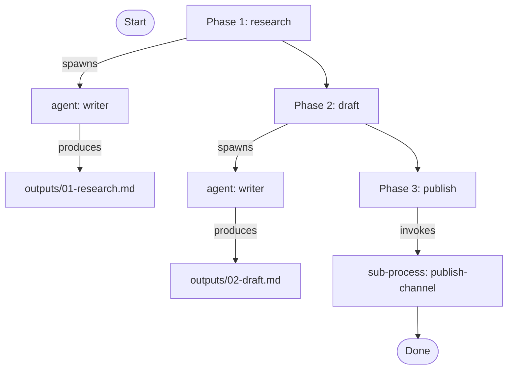

# pas-clief:visualize

Goal: a Mermaid flowchart for a process, useful for understanding flow at a glance and for sharing with others.

## Flow

### 1. Pick the process

Ask: "Which process do you want to visualize?"

If the user gives a name, resolve it via search order: `<user-project>/.claude/skills/<name>/SKILL.md` first, then `<plugin>/skills/<name>/SKILL.md`. Read the recipe.

### 2. Read the recipe

Parse the YAML frontmatter. Extract:
- `agents`, `skills`, `sub_processes`, `phases`.

For each phase, read `phases/NN-<slug>.md` and extract the agent or sub-process named.

### 3. Render

Output a Mermaid flowchart:

Adjust nodes and edges to match the actual recipe. Include:
- Each phase as a node (with phase number).
- Each agent the phase spawns as a sub-node.
- Each sub-process invocation as a sub-node.
- Outputs file as a leaf if specified.

### 4. Write or display

Ask: "Save this to a file (`docs/flow-<process>.md`) or just display?"

If save: write the Mermaid block in a markdown file at the path the user names.
If display: emit the Mermaid block in the chat reply.

## Notes

- Do NOT introduce new state — visualize is read-only.
- If a phase file references an agent or sub-process that doesn't exist, surface the gap as a note in the rendered output.
